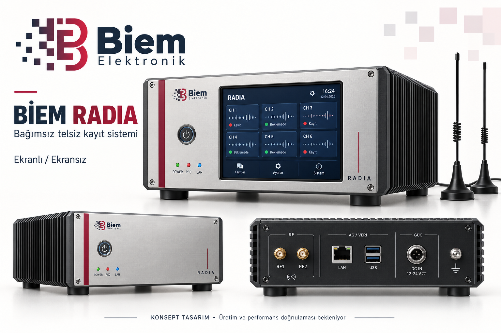

# BİEM RADIA — bağımsız endüstriyel telsiz kayıt cihazı

Tarih: 14 Eylül 2026. Durum: ürün konsepti ve geliştirme hedefi; satışa hazır ürün değildir.

> Güncel adlandırma kararı: **BİEM Radio Integrated Solution**, model **BM-ICC-08**. Aşağıdaki RADIA adları ve görsel tarihsel konsepti yansıtır; son bölümdeki karar bunların yerine geçer. Uygulama ve dosya adlarının değişimi sonraya bırakılmıştır.

## Ürün amacı

BİEM Elektronik markasıyla, izinli telsiz haberleşmesini konuşma bazında kaydeden; kendi işlemcisi ve depolaması bulunan; ekranından veya ağ üzerinden yönetilen özgün bir cihaz geliştirmek. Mevcut çalışan Windows Radia uygulaması başlangıçtır. Son müşterinin sürekli açık harici bir PC kullanmasına gerek kalmaması hedeflenir; işlemci kutunun içinde bulunur.

Rakip ürünün kasası, arayüzü veya metinleri kopyalanmayacak. Farkımız, doğrulanmış kayıt güvenilirliği, anlaşılır kullanım, çözülebilen kimlik/veri/konumun aynı arşivle ilişkilendirilmesi ve servis edilebilir donanım olmalı. Ölçülmemiş performansla “daha iyi” iddiası kullanılmayacak.

## Sunum anlatımı

“BİEM RADIA, telsiz haberleşmesini yerinde kaydetmek ve yetkili kullanıcılara tek noktadan sunmak için geliştirilen bağımsız kayıt cihazı konseptidir. Yerel arşiv, ağdan yönetim ve isteğe bağlı dokunmatik ekran aynı ürün ailesinde buluşur. Analog ve dijital kanal desteği, protokol bazında doğrulanarak genişletilecektir.”

Sunumda dört mesaj: bağımsız çalışma; konuşma ve çözülen kimlikle arşiv; yetkili erişim; modüler alıcı ve servis yapısı. 4/8 eşzamanlı kanal, Linux, web yönetimi ve kesinti dayanımı geliştirme hedefidir. Bunlar mevcut donanımda tamamlanmış özellik olarak sunulmaz.

## Özgün endüstriyel tasarım

- Marka: mevcut BİEM Elektronik logosu; ürün adı RADIA. Bordo vurgu, lacivert metin, saten metal ön panel, grafit alüminyum gövde.
- Aynı ailede ekranlı ve ekransız görünüm. İlk prototipte ekransız kullanım öncelikli; ekran isteğe bağlı.
- Ön panel: güç düğmesi; güç, kayıt ve ağ durum göstergeleri. Hata durumu yalnız renkle anlatılmayacak, arayüzde açıklanacak.
- Arka panel: RF1/RF2, LAN, servis USB, kilitli DC güç ve şasi topraklama için taslak yerleşim. RF ile güç kabloları ayrılacak.
- Metal gövde, sağlam ayaklar, kablo sabitleme, erişilebilir SSD/SDR servisi ve seri numaralı etiket hedeflenir.
- Termal tasarım birlikte yapılmalı: fansız mini PC'yi kapalı ikinci kasaya koymak tek başına yeterli değildir. Isı yolu, RF ekranlama, USB paraziti ve güç filtrelemesi ölçülecek.
- Görseldeki 12–24 V yazısı, port türleri, ekran tarihi ve altı kanal kartı temsilidir. Gerçek voltaj aralığı, kanal kapasitesi, boyut ve konnektörler parça seçimiyle kesinleşecek. Görsel CAD/imalat çizimi değildir. Logo üretim dosyasında özgün kaynak üzerinden uygulanmalı.

## Taslak parça listesi

| Parça | Adet | Seçim / kabul koşulu |
|---|---:|---|
| Mini endüstriyel PC | 1 | Sürekli yükte işlemci performansı; kararlı USB; Ethernet; otomatik açılış; watchdog desteği; servis ve tedarik sürekliliği |
| RAM | 1 takım | Başlangıç hedefi 16 GB; ölçüme göre kesinleşir |
| SSD | 1 | Başlangıç hedefi 1 TB; yazma ömrü, sağlık izleme, güvenli kapanış |
| SDR | 2 hedef | İlk numune orijinal Blog V3; ikinci cihaz çoklu alıcı entegrasyonu ve testinden sonra |
| VHF/UHF anten | 2 opsiyon | Sahaya göre mobil manyetik taban veya sabit anten; mevcut anten varsa paket dışında |
| Kasa ve ön/arka panel | 1 takım | Isıl/RF tasarım, bağlantı sabitleme ve bakım erişimi |
| Güç kaynağı | 1 | Toplam yük ve seçilen PC giriş aralığına uygun, endüstriyel kullanım hedefi |
| USB / RF kabloları | 1 takım | Kısa ve sabitlenmiş; RF bağlantı kayıpları ölçülür |
| Dokunmatik ekran | Opsiyon | 7 inç sınıfı başlangıç fikri; nihai boyut ve çözünürlük açık |
| DC UPS | Opsiyon | Kesintide kayıt sürekliliği veya güvenli kapanış |
| RF filtre / zayıflatıcı | Gerektikçe | Ölçüm sonrası; LNA varsayılan satın alma değildir |

Kesin mini PC modeli ve toplam maliyet henüz seçilmedi. Sadece “i5” veya “endüstriyel” adıyla karar verilmeyecek. Satın alma niyeti belirtildi; sipariş teslimi doğrulanmadı.

## Alıcı ve kanal mimarisi

V3 yalnız alıcıdır; Linux çalıştırmaz ve dosya saklamaz. İşleme, arşiv ve yönetim mini PC'dedir. İki SDR iki konuşma sınırı anlamına gelmez: aynı anlık RF penceresine sığan kanallar yazılımda ayrılabilir. Ancak uzak frekans grupları farklı alıcı gerektirir. Tarama, eşzamanlı kayıt olarak pazarlanmaz.

İlk hedef 4 eşzamanlı RF kanalı; sonra 8. DMR için RF taşıyıcısı sayısı ile konuşma/slot sayısı ayrı raporlanır. Yoğun trafik, USB örnek kaybı ve işlemci yükü birlikte ölçülmeden kapasite garantisi verilmez.

Mevcut RTL-SDR hattına karşılık AD9363/Zynq Ethernet kartı ayrı bir gelecekteki platformdur. Windows uygulaması orada doğrudan çalışmaz. Resmî kapsam dışı firmware özellikleri ve kartın CPU kapasitesi doğrulanmalıdır.

## Mevcut durum ve kanıt sınırları

- Analog FM alım ve kayıt kullanıcı tarafından doğrulandı. 13 Eylül son analog denemesinde ses duyulmuş, parazit bildirilmiştir.
- TETRA: kullanıcı BİEM'de anlaşılır ses ve başarılı kayıt bildirdi. Bu, bütün TETRA sistemlerinin desteklendiği anlamına gelmez.
- DMR: 13 Eylül 23:45 civarı günlük ve arşivde 3,96 saniyelik ses dosyası, kaynak ID 3737, grup 3737 ve CC 1 görüldü. Slot doğrulanmadığından boştu. Asistan sesi dinleyerek doğrulamadı; senkron ve kayıt oluşumu doğrulandı.
- Son DMR testinde kullanıcı telsiz TX frekansını 442.600 MHz olarak düzeltti; BİEM 442.5445 MHz'teydi. Fark -55,5 kHz, yaklaşık 125,4 ppm büyüklüğünde. Ayarlar Tuner AGC ve PPM 2 idi. Bu veri tek başına osilatör hatasını kanıtlamaz; düzeltme yönü ve ikinci frekansta doğrulama bekleniyor. Kalibrasyon tamamlanmadı.
- TETRA Main Carrier 1094, Band 4, Offset 0: bildirilen ana taşıyıcı 427.350 MHz'tir; ayarlı 427.5445 MHz ile doğrudan eşit kabul edilmez. Başka taşıyıcı ihtimali ayrılmadan buradan PPM hesaplanmaz.
- Harita, veri günlüğü, mesaj arşivi ve kimlik alanları geliştirme kapsamında mevcut; GPS/SDS tam kapsamlı saha kabulü tamamlanmış sayılmaz.
- XPT / Capacity Plus / Capacity Max / Tier III etiketleri yalnız doğrulanmış protokol kanıtına dayanmalı. Genel DMR senkronu marka kanıtı değildir.
- Çoklu SDR, Linux cihaz, web yönetimi, PoC gateway ve 4/8 kanal ürün kapasitesi henüz bu çalışmada doğrulanmadı.
- Yerel çalışma ağacında geniş kapsamlı önceki geliştirmeler var. Bu tasarım commit'i çalışan kaynak kodun tamamının GitHub ile eşitlendiği anlamına gelmez.

## Korunacak kurallar

1. Çalışan ilk sürüm ve SDR# kurulumuna zarar verilmez. Cihaz/Linux/web geliştirmesi ayrı kopya veya dalda yapılır.
2. ID, grup, fiziksel slot ve konum tahminle doldurulmaz. Bilinmeyen açıkça gösterilir; analog kimlik alanları boş kalır.
3. Kayıt en fazla 90 saniye; ardından 2 saniye ara. DSD-FME tabanlı modlarda mevcut uygulama çağrı bitiminde içe aktarıp böler; canlı 90 saniyelik teslimle aynı değildir.
4. Kullanıcının son TETRA sessiz taşıyıcı tarama hedefi 20 saniyedir. Eski RECORDING_LIMITS.md dosyasında 120 saniye yazıyor; kaynak ve testlerle uzlaştırılacak. Bu belgede eski not sessizce güncel davranış sayılmadı.
5. DMR CC otomatik keşif, çözülen yayından yapılır; 0–15 filtre değerlerini körlemesine döndürmekle karıştırılmaz. Frekansı yazmak ID/grup üretmez.
6. Tamamlanan kayıtlar yetkili dinlemeye açık olmalı. Mevcut Windows DPAPI ve uygulama yönetici kontrolü Linux'a doğrudan taşınamaz. “Yalnız bu program çözebilir” mutlak garantisi verilmez.
7. Geçici çözücü sesleri ve ham günlüklerin koruması ayrıca tasarlanır; uygulamadaki arşiv şifrelemesi bütün diski şifrelemek değildir.
8. dBFS, kalibrasyonsuz dBm diye gösterilmez. Spektrum tepe eşiği ile kayıt squelch eşiği ayrıdır.
9. Gerçek ses kabulü; sentetik sinyal, gürültü kaydı veya yalnız dosya oluşumuyla kanıtlanmaz.
10. Kayıtlar, saha günlükleri, konumlar, özel ayarlar ve üçüncü taraf ikililer Git'e eklenmez.

## Cihaz yazılımı hedefleri

- Elektrikle otomatik açılma; arka planda alım servisi; uygulama hatasında kontrollü toparlanma.
- Ağ olmasa da yerel kayıt; ağ geri geldiğinde arşiv erişimi.
- Canlı kanallar, kayıt arşivi, mesajlar, harita, kimlik rehberi; yöneticiye özel spektrum ve cihaz ayarları.
- SDR tipi, benzersiz seri numarası/USB konumu, bağlı/meşgul/hata durumu. Bir cihazın arızası diğer kayıtları durdurmamalı.
- Kullanıcı/rol yetkileri, denetim günlüğü, HTTPS, anahtar yedekleme ve kurtarma tasarımı. Dış erişim için kontrollü ağ/VPN yaklaşımı.
- SSD doluluk ve sağlık uyarıları; eski kayıt silme politikası açıkça yapılandırılır. Koruma altındaki kayıtlar otomatik silinmez.
- Bağlantı ve disk hataları kullanıcıya görünür; başarılı kayıt ile yalnız sinyal algılama ayrı durumlar.
- Kayıt sürerken tamamlanan kayıtları dinleme; tarih/kanal/isim/ID/grup/slot arama.
- GPS yalnız geçerli ve eşlenmiş koordinatla; son görülme zamanı ve eski konum işareti. Yayın alınmaması telsizin kapalı olduğunu kanıtlamaz.
- Konuşmayı yazıya çevirme, rapor, anahtar kelime alarmı ve DMR–PoC bağlantısı sonraki aşama. HyTalk API/lisans erişimi doğrulanmadan entegrasyon vaat edilmez.

## Kabul ve satışa geçiş

Sıra: tek V3 referans alım/kalibrasyon; iki SDR kaynak ayrımı; 4 sonra 8 kanal yoğun trafik; uzun süreli kayıt; güç/ağ/disk hata senaryoları; yetki ve kurtarma testleri; kasa ısı/RF testleri. Her testte yazılım sürümü, donanım ve koşullar kaydedilir.

Hassasiyet, seçicilik, intermodülasyon, sıcaklık aralığı ve kesintisiz çalışma sayıları ölçülmeden satış föyüne yazılmaz. Rakibin -117/-120, 62 dB, -20/+70 °C değerleri bizim ürünün özelliği değildir. Ticari dağıtım öncesi çözücü/vocoder ve harita lisansları, bağımlılık dağıtım şartları ve uygulanabilir ürün uygunluk gereklilikleri incelenir. Kod paketleme tersine mühendisliği mutlak engellemez.

## Referanslar ve görsel üretimi

- Kullanıcının ürün örneği: https://idearge.com.tr/prolupus-cr-drs-telsiz-kayit-cihazi/
- Kullanıcının iki sayfalık CR-DRS broşürü okundu; üçüncü taraf PDF ve görselleri bu pakete kopyalanmadı.
- V3: https://www.rtl-sdr.com/wp-content/uploads/2018/02/RTL-SDR-Blog-V3-Datasheet.pdf
- Orijinallik: https://www.rtl-sdr.com/genuine/
- Logo: kullanıcının verdiği biem-logo.png referansı.
- Görsel, yerleşik image_gen aracıyla üretildi; üretim istemi PROMPT.md dosyasındadır. Harici tasarımcıya mesaj gönderilmedi.
- Görsel ve metin sunum konseptidir. Altı örnek ekran kartı, 12–24 V işareti, kasa oranları ve portlar nihai teknik özellik değildir.

Bu paket dokümantasyon ve tasarım kaydıdır; uygulama kodu veya alıcı ayarları değiştirilmedi. RF/performans testi bu işlemde yapılmadı.

Git doğrulama notu: yalnız bu üç tasarım dosyası commit kapsamındadır. İlk commit denemesinde pre-commit, takip edilen yerel kod değişikliklerini geçici kaldırınca henüz takip edilmeyen yeni modüller eski modellerle uyumsuz kaldı; ty/basedpyright ve test toplama başarısız oldu. Değişiklikler otomatik geri yüklendi. Doküman commitinde kod hookları tek işlem için atlandı; kod testleri geçmiş gibi raporlanmaz. Görsel elle incelendi ve staged diff kontrol edildi.

## Son karar — ürün adı ve model (14 Eylül 2026)

- Kullanıcı RADIA adının bırakılmasını istedi.
- Cihaz tipi / ürün adı: **BİEM Radio Integrated Solution**.
- Model: **BM-ICC-08**.
- İsim değişikliği daha sonra uygulanacak. Şimdilik çalışan yazılım, dosya/klasör yolları, depo adı ve mevcut konsept görseli değiştirilmez.
- Önceki RADIA açılım ve slogan önerileri kabul edilmiş ürün kimliği sayılmaz. Yeni bir slogan henüz belirlenmedi.
- Modeldeki ICC harflerine kullanıcı tarafından bir açılım verilmedi. “08” model adı tek başına sekiz eşzamanlı kanalın doğrulandığı anlamına gelmez; kapasite kabul testine bağlıdır.
- Bu güncelleme yalnız karar kaydıdır; kod veya donanım değişikliği değildir.
