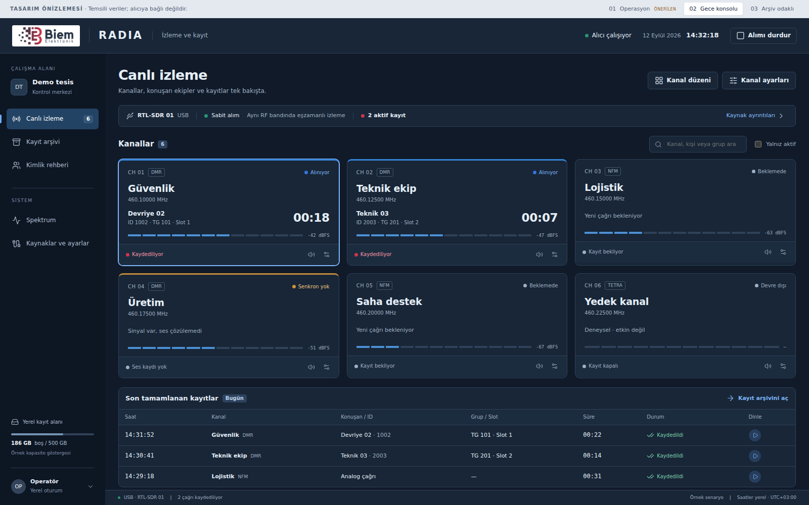
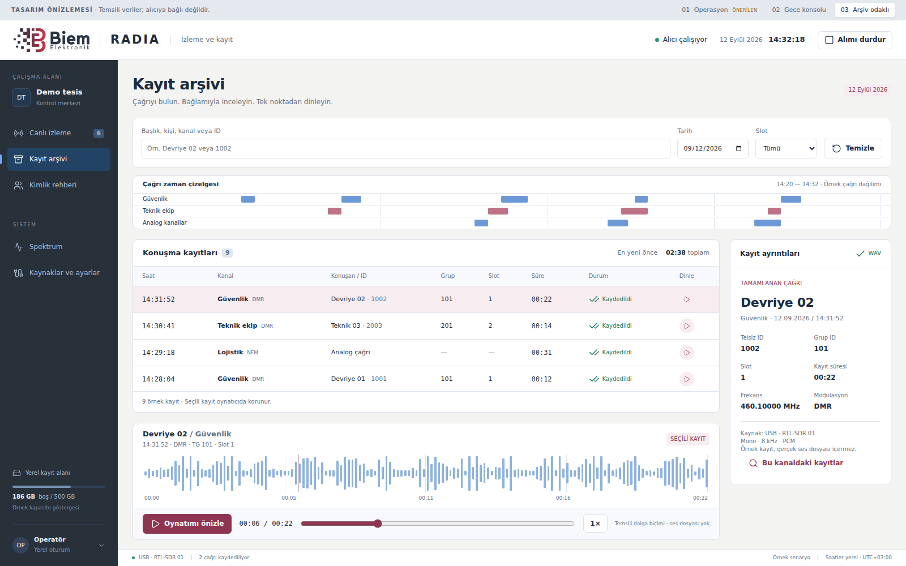

# BIEM Radia — operatör konsolu tasarım paketi

**Önerilen yön: 01 / Operasyon.** Küçük ve orijinal BIEM logosu, koyu gezinme alanı, açık çalışma yüzeyi, kısa kanal kartları ve seçili çağrı paneli. Öncelik: kimin konuştuğunu, sesin kaydedilip kaydedilmediğini ve ilgili kaydın nerede olduğunu hızlıca anlamak.

Bu paket kullanıcının 12 Eylül 2026 tarihli arayüz talebi için hazırlanmıştır. Çalışan alıcı, DMR çözücü, kayıt motoru, arşiv veritabanı ve Windows başlatma dosyaları değiştirilmez. Buradaki HTML **görsel ve etkileşimli referanstır**; uygulamayı web teknolojisine taşıma kararı değildir.

## Ekranlar

| Yön | Kullanım | Yerleşim |
|---|---|---|
| **01 Operasyon — önerilen** | Günlük güvenlik / İSG izleme ve ürün demosu | Açık zemin, koyu sol gezinme, kanal kartları + sağda çağrı ayrıntısı, altta son kayıtlar |
| 02 Gece konsolu | Karanlık kontrol odası, uzun vardiya | Koyu yüzeyler, daha geniş ve büyük kanal kartları; ayrıntı seçildiğinde yan panel |
| 03 Arşiv odaklı | Kayıt arama ve olay inceleme | Sıcak açık yüzey, zaman çizelgesi, yoğun kayıt tablosu, seçili kaydın dalga biçimi ve oynatıcısı |

## Önizlemeyi açma

`docs/ui/index.html` dosyasını bir tarayıcıda açın. Kurulum, sunucu, internet veya SDR cihazı gerekmez. Üstteki 01 / 02 / 03 düğmeleri tasarım yönlerini değiştirir.

Tek dosyalık paylaşım için: [BIEM_Radia_Arayuz_Onizleme.html](BIEM_Radia_Arayuz_Onizleme.html). CSS, ikonlar, logo ve etkileşim kodu bu dosyanın içindedir.

- Kanal araması ve “Yalnız aktif” filtresi.
- Kanal seçimi, ayrıntı paneli, yerel dinleme sesi durumu.
- Kayıt arşivi: metin, tarih ve slot filtreleri; kayıt seçimi; görsel oynatıcı ve zaman çubuğu.
- Analog / DMR / TETRA için farklı ayar paneli.
- Alımı durdurma ve spektruma geçme etkisini gösteren onay akışı.
- Kaynak bağlantıları ve müşteri kapsamında kimlik rehberi yerleşimi.

Tüm kişi/ekip adları, ID'ler, frekanslar, kayıtlar, sinyal seviyeleri, disk bilgisi ve grafikler **temsili**dir. Frekanslar kullanım izni veya kanal planı önerisi değildir. Prototip cihaz açmaz, yayın yapmaz, gerçek çağrı kaydetmez, ses dosyası oynatmaz ve ayarları diske kaydetmez. Oynatıcı yalnızca etkileşimi gösterir. Rehber ve alıcı ayarları yerleşim örneğidir. Kanal panelinde ad, frekans ve mod önizlemeye uygulanır; diğer alanlar yerleşim referansıdır.

## Codex için başlangıç

1. [CODEX_UI_BRIEF.md](CODEX_UI_BRIEF.md): uygulanacak tasarım, davranışlar ve sıralama.
2. [design-tokens.json](design-tokens.json): renk, ölçü ve yazı sistemi.
3. [REFERENCE_REVIEW.md](REFERENCE_REVIEW.md): incelenen üretici ekranları ve çıkarımlar.
4. [VALIDATION.md](VALIDATION.md): prototip kontrolü ve gerçek uygulama kabul sınırları.

**Kaynak sürümü notu:** GitHub ana dalı inceleme sırasında `e27f0a9` idi; Python/Tk DMR geliştirme dalı `codex/dmr-receiver` / `4e30773` ayrıca incelendi. Kullanıcının son ekranları bu dallarda görünen arayüzden daha ileride. Uygulama başlamadan **PC'de gerçekten çalışan kaynak sürümü** esas alınmalı; bu tasarım dalı eski uygulama kodunu PC'ye taşımak için kullanılmamalı. Tasarım dosyaları bağımsızdır.

Tasarım dalının varlığı, kullanıcının ayrı yerel Codex oturumunda görevin otomatik çalıştığı anlamına gelmez.

Kullanıcının ayrıca belirttiği `BIEM_RADIA_PROJE_NOTLARI_VE_ARAYUZ_BRIFI.md` yerel dosyasının içeriğine bu oturumda erişilemedi. Codex başlangıç talimatında bu dosyanın PC'de önce okunması istendi.
