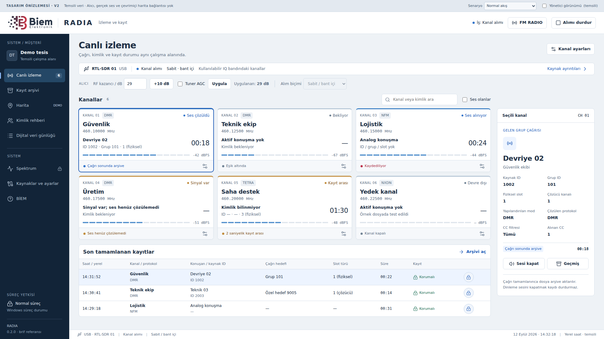

# BİEM Radia — Operasyon V2

**Güncel tasarım ve Codex uygulama paketi.** Kullanıcının 12 Eylül 2026 birleştirilmiş brifi okundu; açık renkli Operasyon düzeni mevcut Windows uygulamasına göre güncellendi.

**[Tek dosyalık etkileşimli önizlemeyi aç](BIEM_Radia_Arayuz_Onizleme.html)** · internet, kurulum veya SDR gerekmez. Kaynak sürümü `index.html`; üretim: `python docs/ui/build-preview.py`.

## Ana tasarım

Altı kısa kanal kartı, seçili çağrı, RF kazancı / Tuner AGC ve son tamamlanan kayıtlar. Kullanıcı ayar kutularının arasında çağrı aramak zorunda kalmaz. DMR özel hedef / grup, fiziksel slot / çözücü kanalı, alınan CC / CC filtresi ayrıdır.

## Diğer ekranlar

| Önizleme | Amaç |
|---|---|
| [Korumalı kayıt arşivi](previews/02-korumali-arsiv.png) | Arama, slot türü, yetkili dinleme, dosya durumu |
| [Harita](previews/03-harita.png) | Son geçerli tek konum, yaş ve özgün telsiz görseli |
| [Dijital veri günlüğü](previews/04-dijital-gunluk.png) | Çözücü metni ve yalnız yeni satırlara uygulanan filtre |
| [Yönetici spektrumu](previews/05-yonetici-spektrumu.png) | Büyük spektrum/şelale, seviye ve zoom kontrolleri |
| [Kaynaklar](previews/06-kaynaklar.png) | Alıcı, USB envanteri, çevrimdışı Hytera yapılandırması |
| [1280×920](previews/07-1280x920.png) / [1366×768](previews/08-1366x768.png) | Küçük pencerede kanal düzeni |

Kimlik rehberi, BİEM ekranı ve üstten açılan FM RADIO da etkileşimli önizlemede bulunur. Üstteki senaryo seçimiyle eksik/meşgul cihaz, özel DMR hedefi, tarama sırası, arşiv hatası ve boş/eski/eksik karo harita durumları incelenebilir. “Yönetici görünümü” **yalnız tasarım durumunu** değiştirir; Windows UAC taklidi veya gerçek yetki yükseltme değildir.

## Codex için uygulama

Başlangıç dosyası **[CODEX_UI_BRIEF.md](CODEX_UI_BRIEF.md)**. Yapılacaklar; yalnız UI, ek backend olayı gerekebilecek işler ve sonraki ürün aşaması olarak ayrıldı. [design-tokens.json](design-tokens.json) ölçü/renk sistemi, [REFERENCE_REVIEW.md](REFERENCE_REVIEW.md) üretici ekran incelemesi, [VALIDATION.md](VALIDATION.md) kontrol sonuçlarıdır.

Bu klasör görsel referanstır; Python/Tkinter/ttk uygulamasını web’e taşıma kararı değildir. Tasarım dalı eski `main` kaynaklarından ayrılmıştır. **Yerel çalışan, henüz commit edilmemiş 0.2.0 kaynaklarının üzerine bu dalın `src` dosyaları kopyalanmamalı.** Yalnız `docs/ui/` tasarım girdileri alınmalı; çalışan dal ve yerel notlar esas alınmalıdır.

## Kapsam

Tüm kişiler, ID’ler, çağrılar, frekanslar, cihaz envanteri, dosyalar, seviyeler, saatler ve telsiz konumu temsili. Önizleme gerçek ses çalmaz/kaydetmez, SDR açmaz, çevrimiçi haritaya bağlanmaz, ayar veya kayıt dosyası yazmaz. Frekanslar kullanım/kanal planı önerisi değildir. Kontroller birer etkileşim referansıdır; örnek form değişiklikleri yalnız bellekte kalır, bazı gelişmiş formlar yalnız yerleşimi gösterir.

Koruma, kaynak sahipliği, 90/2 kayıt kuralı ve protokol doğrulaması gerçek uygulamada mevcut backend tarafından uygulanmalıdır. HTML içindeki durum değişimleri RF veya güvenlik kabul testi sayılmaz. Dosyaların PR’a gönderilmesi, ayrı Windows Codex oturumunun otomatik başladığı anlamına gelmez.

Özgün logo, amblem ve telsiz WebP’si kullanıcı paketinden değiştirilmeden alındı. Lucide ikon lisansı `assets/LUCIDE-LICENSE`; Natural Earth altlığı kamu malı. Gerçek kayıt, konum günlüğü veya harita karo paketi bu depoya eklenmedi.
